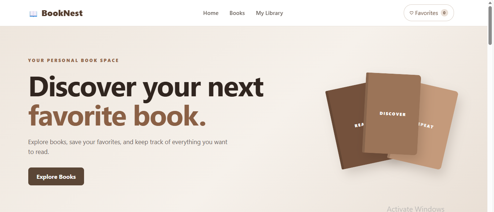
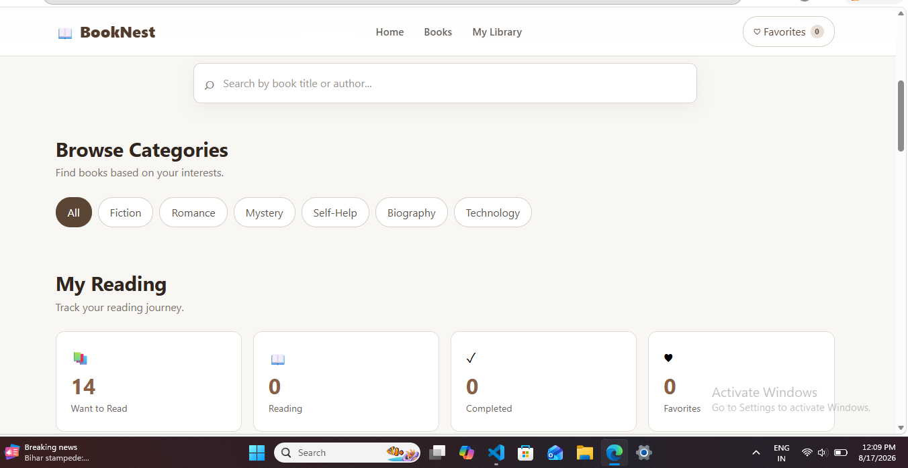
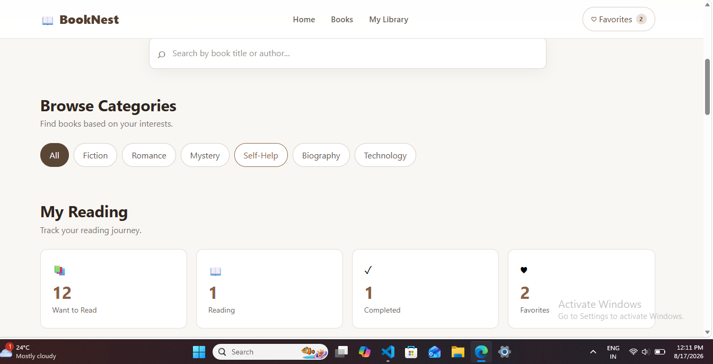
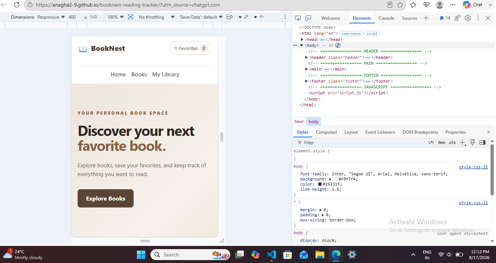

# 📚 BookNest – Book Discovery & Reading Tracker

BookNest is a responsive frontend web application designed to help users discover books, search for books, save favorites, and track their reading journey.

The project uses **HTML, CSS, JavaScript, and LocalStorage** to provide an interactive experience without requiring a backend or database.

## ✨ Features

- 📚 Browse a collection of books
- 🔎 Search books by title or author
- 🏷️ Filter books by category
- ❤️ Add and remove books from favorites
- 📖 Track reading status:
  - Want to Read
  - Reading
  - Completed
- 💾 Save favorites and reading status using LocalStorage
- 📊 Reading dashboard with live statistics
- 🔄 Combine search and category filters
- 📱 Responsive design for desktop, tablet, and mobile
- 🚫 User-friendly empty states
- 🎨 Clean and modern interface
## 📸 Screenshots

### 🏠 Home



### 📚 Book Discovery & Search



### 📖 My Reading



### 📱 Responsive Mobile Design



## 🛠️ Technologies Used

- HTML5
- CSS3
- JavaScript
- LocalStorage
- Git
- GitHub

## 📂 Project Structure

```text
BookNest/
│
├── index.html
├── style.css
├── script.js
├── README.md
├── .gitignore
│
├── assets/
│   └── books/
│
└── screenshots/
    ├── Home.png
    ├── book-search.png
    ├── my-reading.png
    └── mobile.png